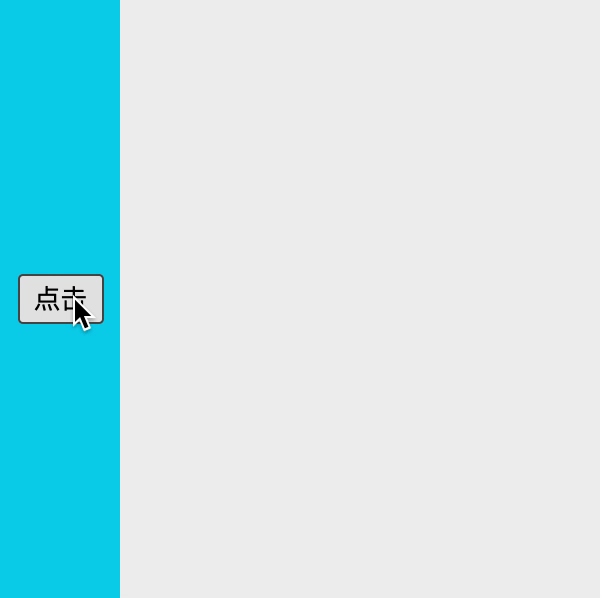
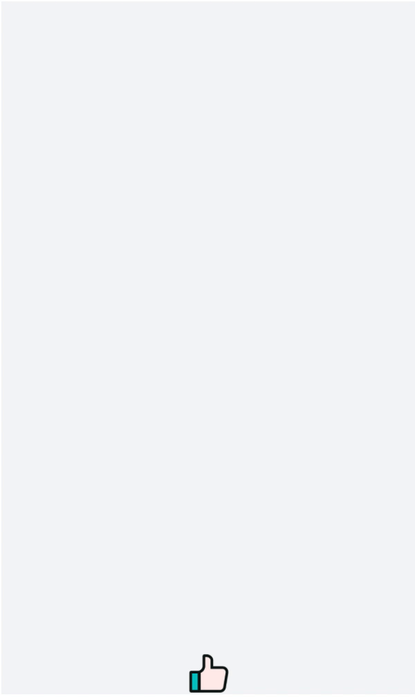

# 再不学点动画就捞了

## 前言

动画一直都是界面交互中比较复杂的部分，却也是点睛之笔，一个好的动画效果能让人眼前一亮，在交互上加分。本篇记录一下自己项目中使用动画的案例，希望会对你有帮助。

以下的[demo](https://github.com/dyshh/demo)都可以clone到本地自己玩一下。

## 从简单的过渡开始



要实现以上动画效果，首先要思考的一个问题，这个小抽屉，要怎么出现，然后怎么消失？

### 入场和出场

我们通常把出现叫`入场`， 消失叫`出场`。

描述这个小抽屉的动画效果：`入场`阶段，从左边向右平移出来，从透明到不透明；`出场`阶段，又向左边平移回去，从不透明到透明。

4个需要控制状态的节点：`入场前` -> `入场后` -> `出场前` -> `出场后`

需要注意的一点，在这个案例中，`入场前`和`出场后`的状态相同，`入场后`和`出场前`的状态相同，而且大多数的动画都有这样的特点，所以我们要确定的样式就只有两种，动画效果就交给过渡`transition`属性即可。

`入场前`和`出场后`，两个跟动画有关的属性，`opacity`和`transform`

```css
.drawer {
    opacity: 0;
    transform: translateX(-150px);
}
```

`入场后`和`出场前`，会变成

```css
.drawer.show {
    opacity: 1;
    transform: translateX(0);
}
```

有了这两组样式，这个动画就完成的差不多了，只需要在抽屉`visible=true`时加上`show`的`className`即可，如此简单。

### 元素卸载

常见需求：在抽屉不显示的时候移除元素。这是有个问题要思考一下：只有一个`visible`的`state`控制抽屉的显隐，而当`visible=false`时，整个元素一下子移除了，就没有`出场`动画可以显示了。为此需要维护多一个`isShow`的`state`来专门控制是否添加`show`类名，并且`visible`需要在出场后才设为`false`。

同样的，如果同时设置`visible`和`isShow`为`true`，你会发现入场动画没有了，还是同样的原因，**动画其实就是样式控制而已，而样式是建立在dom元素的基础上的**，元素还没插入，加上了`show`类名也没用，动画不会出现，因此我们只需要用经典的`setTimeout(fn, 0)`方法就可以解决，让`isShow`在`visible=true`后晚那么一点点设置即可。

[源代码](https://github.com/dyshh/demo/blob/master/src/components/transition/demo-1.js)在这里。

### 优化

[React Transition Group](https://reactcommunity.org/react-transition-group/)是React官方的动画库。上面的`isShow`这个`state`其实是个通用逻辑可以被抽取的，这个库的`CSSTransition`组件就帮我们做了这件事，延时的逻辑就不需要我们写了，只需要传`unmountOnExit`，代码会简洁很多。

[源代码](https://github.com/dyshh/demo/blob/master/src/components/transition/demo-2.js)在这里。

## 使用animation-timing-function: steps()

`animation`这个css属性相信大家都用过，用它能做出复杂的动画效果，那需要在交互方向上有较深的造诣，这里介绍的利用`animation-timing-function: steps()`配合设计图也能做出看似复杂的动画，前提是有一张漂亮的设计图。


原理和动画片的播放一样的，上面说的设计图就是由一张张横拼起来的长图，用作背景图，利用`background-position`从左到右播放，看起来就像动画了，动画的连贯性（衔接得好不好）就只和设计图有关。

```scss
.like {
    width: 100px;
    height: 100px;
    background-image: url('./heart.png');
    background-size: cover;
    background-repeat: no-repeat;
    animation-duration: 0.8s;
    animation-fill-mode: forwards;
    animation-timing-function: steps(28);

    &.animate {
        animation-name: burst;
    }
}

@keyframes burst {
    0% {
        background-position: left;
    }
    100% {
        background-position: right;
    }
}
```

`steps(28)`中的`28`就是长图中小图的数量，这一点很容易看出来。

用一个`flag`的`state`控制是否加上`animate`类名，和transition不同的是，这里切换的是`animation-name`或`animation`属性，而transition切换的是这个动画涉及的`变化`属性，如`opacity`等，在animation里这些属性都写在`@keyframes name`里的，因此可以写出比较复杂的动画。

`animation-fill-mode`属性大家也应该比较陌生，按理说动画播放完了应该回到第一帧，设置`forwards`能让它在结束后保持最后一帧，这也是为什么红心点赞完后背景色是填充的。

[关于`step`函数的深入理解](https://www.zhangxinxu.com/wordpress/2018/06/css3-animation-steps-step-start-end/)，涉及的东西比较复杂这里不详细说。

## 位置移动类动画

下面这个效果是不是在有点似曾相似呀？比如直播间里刷礼物互动的地方就比较常见。



简单说说实现思路，这个动画关键点是这些飘上去的元素的运动轨迹，涉及一个叫`贝塞尔曲线`的函数

### 三阶贝塞尔曲线

图中红色线的轨迹就是3阶贝塞尔曲线的轨迹，和我们元素飘动的轨迹是类似的


其实为什么要用`贝塞尔曲线`,固定左右运动不好吗？我的理解是贝塞尔的轨迹更像那么一回事，有点冒泡的感觉，就是效果更好。但其实我们并不关心贝塞尔曲线是怎么来的，那些属于数学范畴了，只需得到这些点的坐标就行了。

```js
/**
  * 三阶贝塞额曲线公式
  * t 取值区间为[0, 1]，和这条曲线又多少点组成有关，
  * 比如50个点，t取值就为0/50、1/50、2/50、3/50 ...
  * p0, p1, p2, p3 分别是四个点坐标
  */
threeBezier(t, p0, p1, p2, p3) {
  const [x0, y0] = p0
  const [x1, y1] = p1
  const [x2, y2] = p2
  const [x3, y3] = p3
  const x =
        x0 * (1 - t) * (1 - t) * (1 - t) +
        3 * x1 * t * (1 - t) * (1 - t) +
        3 * x2 * t * t * (1 - t) +
        x3 * t * t * t
  const y =
        y0 * (1 - t) * (1 - t) * (1 - t) +
        3 * y1 * t * (1 - t) * (1 - t) +
        3 * y2 * t * t * (1 - t) +
        y3 * t * t * t

  return [x, y]
}
```

### 播放动画

#### 初始化元素

先在容器里创建元素

```js
// 创建dom 开始动画
create(cb) {
  // 初始化元素
  const div = document.createElement('div')
  div.style.width = `${this.width}px`
  div.style.height = `${this.height}px`
  div.style.position = 'absolute'
  div.style.opacity = '0'
  const originTop = this.boxHeight - this.height
  const originLeft = this.boxWidth / 2 - this.width / 2
  div.style.left = `${originLeft}px`
  div.style.top = `${originTop}px`
  cb && cb(div)
  this.box.appendChild(div)
  // 获取四个点关键
  const line = this.getBezierLine([originLeft, originTop])
  // 获取一连串贝塞尔曲线坐标点
  const points = this.getBezierPoints(this.pointsNum, line.p0, line.p1, line.p2, line.p3)
  // 根据坐标点改变元素位置
  this.playAnimationAtOneFrame(points, div)
}
```

#### requestAnimationFrame

`requestAnimationFrame`和`setInterval`的区别大家应该都有了解过，js执行的动画更推荐使用`requestAnimationFrame`，它能使**元素改变的频率和浏览器刷新频率一致**，从而防止掉帧。

```js
// 使用requestAnimationFrame播放更流畅，不掉帧
play(points = [], cb) {
  let id
  const start = () => {
    points.length && cb(points.shift())
    if (points.length) {
      id = requestAnimationFrame(start)
    } else {
      cancelAnimationFrame(id)
      cb()
    }
  }
  // 第一帧
  id = requestAnimationFrame(start)
}
```

在`play`方法中，浏览器如果每隔 `1000/60=16.7ms`刷新一次屏幕，就能同步的每隔这个时间产出一个坐标点。

#### 更新样式

上面的`create`方法中最后调用了`playAnimationAtOneFrame`，`playAnimationAtOneFrame`方法就是拿到每次浏览器刷新屏幕时产出的坐标点，然后改变位置、透明度等样式，在浏览器下次刷新屏幕时更新，于是就形成了连贯的动画。

```js
playAnimationAtOneFrame(points, div) {
  this.play(points, (p) => {
    // 动画结束移除dom
    if (!p) {
      this.box.removeChild(div)
      return
    }
    // 更新dom坐标
    div.style.left = `${p[0]}px`
    div.style.top = `${p[1]}px`
  })
}
```

完整源代码在[这里](https://github.com/dyshh/demo/blob/master/src/components/like-pro/bezier-animate.js)

## 结语

动画虽然不是必须的，但如今前端界越来越百花齐放，也细分出了很多方向，只会点大家都会的难免会不够。本文也只是一些皮毛，但应该把东西说清楚了。小弟的第一篇文章，点个赞呗~